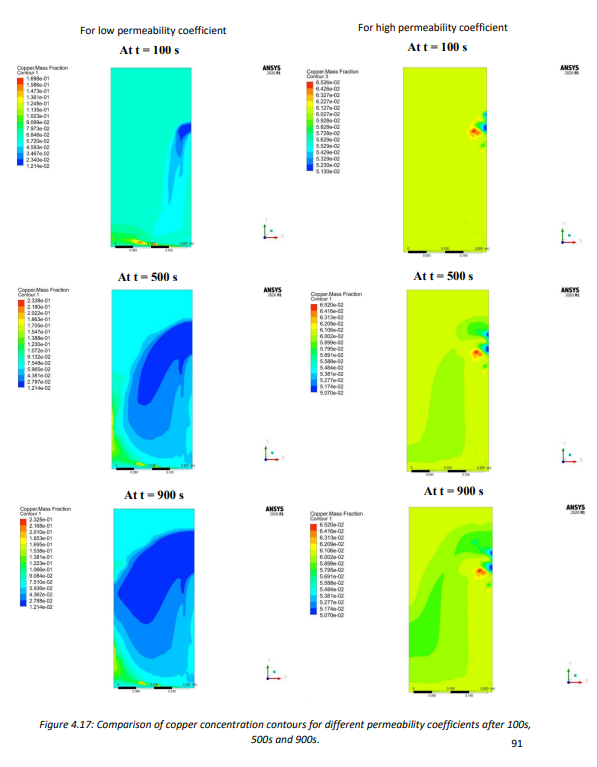

 
*** Here we are providing only brief overview of the problem, results, conculsion and future work. ***
 
 

 <h2> Introduction </h2> 

 
 

<h4> Overview of the DC Casting Process </h4>

DC Casting was first developed by VAW (Germany) and Alcoa (USA) in the early 1930s.Nowadays, it is the principal process for casting most non-ferrous metals, especially aluminium, which can be extruded, rolled and remelted later in subsequent operations. DC casting is done for
around 10 million tons per annum of aluminium worldwide. It can also be used for other non-ferrous elements like Copper, Zinc and Magnesium.

Rolling mill feedstock was cast by the “Book Mould Process ” before DC casting arrived. In this process, a two-piece mould, made up of steel, contains aluminium, and water is sprayed from outside for further cooling. A fine-grained structure was obtained from this process because the 
direct cooling effect provided by water sprays gave a much higher cooling rate resulting in reduced variation in the microstructure.

DC caster plays the role of a link between liquid metal and semi-fabricator. Liquid metal can be obtained through reduction cells or from scrap melter. Semi-fabricator product includes Rectangular sections and circular sections. Rectangular sections include block, ingot and slab, which are used by rolling mill to produce plate, sheet and foil. The circular section includes billets 
that are commonly extruded or forged.

 
<h4> Competing Process </h4>

Several other processes exist for non-ferrous metals. For example, 1-12 mm thickness sheets can be produced using the Continuous Twin-rolls Cast Strip process. Similarly, slabs of 20-75 mm can be continuously cast. Foil production is well established using Twin Roll Caster. These processes 
have some advantages over DC casting as these are fully continuous, leading to a reduction in energy cost to roll the material to the final gauge. However, these processes cannot produce a full range of sheet alloys, limiting their applicability. For more comparison and detailed description of these processes, please see references.

Some other continuous casting processes, such as “Poperzi” , “Castex/Conform” and “Southwire”, are more specialised for specific products such as overhead power cable production. In this process, a metal solidifies on a wheel or block with a groove machined on the periphery. The product is processed further.

 
<h4>DC Casting: Process Description </h4>

Figure 1.1 shows the schematic of DC casting. The liquid metal is filled into a water-cooled mould first. The solidified shell gets cooled directly at a later stage after coming out of the mould. Water acts as a universal coolant for both the primary cooling in the mould and the secondary coolingzone. Enough heat is extracted in the mould region so that the ingot that comes out from the mould should form a solid shell that has enough strength to hold the liquid metal inside it without breakage.

At the start of the process, the liquid metal is poured into a water-cooled mould. It is supported at the open end by a dummy or starter block. This starter block provides initial cooling at the base of the ingot through conduction. Subsequently, the casting is lowered into the pit for a vertical DC caster and onto a runout table for a horizontal DC caster. Casting stops when ingot reaches the base of the pit of the vertical caster. Casting speed depends on alloy composition and size of the casting and, in general, varies in the range of 1-3 mm/sec. 

  
  

 
<h4>Designs of DC Moulds </h4>

There are two principle designs of DC casting mould viz. float controlled melt flow and hot 
top design. Along with this, there is a modern design using an electromagnetic field called 
Electromagnetic Mould.
Schematics of a float controlled melt flow (conventional design), and hot top designs are shown 
in Figure 1.3, whereas an electromagnetic mould is shown in Figures 1.4. The hot top design has 
some advantages over the conventional design as flow control is not required in this process. As 
the top is covered, the heat loss from the top and the oxidation of the top layer are minimized. We 
have used this design in our model.
An electromagnetic wave is produced in the electromagnetic mould, which helps to repel metal 
away from the mould wall; hence, the mould forms an ingot shape. In this process, the entire heat 
is extracted through the direct cooling zone only. As a result, a fine microstructure results. Since 
the electromagnetic force also provides agitation, ingot has homogenized properties. Also, surface 
quality is good because of the absence of direct contact with the mould.

  
  

 
<h4>Modelling of DC Process </h4>

Mathematical models employed for the study of macrosegregation and their application to metallic 
systems, including DC casting, are well documented. These are discussed in detail in Chapter 
2. In addition, there have been advances in the integration of models, both vertical and horizontal,
for Integrated Computational Materials Engineering (ICME) based optimization of products and 
processes. A few of these are listed in Chapter 2. In this work, we revisit the modelling of DC 
casting process to facilitate horizontal linkages with downstream processes. 

 
<h4>Objectives of the present work </h4>

Based on the literature review and the need of hour to develop an integrated model, the following 
objective has been undertaken as the part of this work: 

(i) To develop a 2-dimensional mathematical model of a DC caster.

(ii) To obtain parameters required for empirical modelling of as-cast structure and 
properties, and

(iii) To get structure and properties using empirical models to provide a horizontal linkage 
with the downstream processes.

 
<h4>Aluminum Process Chain </h4>
 

   

 
<h4>Vertical and Horizontal Integration </h4>
 

   

 

 

 <h2> MATHEMATICAL MODEL DEVELOPMENT </h2> 

 
<h4> Geometry of the model </h4>
 

   

 
 
<h4> Initial and Boundary Condition </h4>
 

   

 
<h2> Results and Discussion </h2>
 
Mechanical properties were predicted using secondary dendrite arm spacing and 
eutectic fraction for Al- Cu alloys. Secondary dendrite arm spacing at a particular location can be 
calculated using total solidification time for that location. A total of 40 points were taken at 
different positions for the calculation of secondary dendrite arm spacing and eutectic fraction from 
the mathematical model developed in Fluent. Starting from the base 10 points are taken along a horizontal direction 
at different heights of 0.0625m, 0.125m, 0.1875m and 0.25m . Data for liquid fraction and 
temperature is saved for every flow time of 1 sec until the solution achieves Steady-state. 
Solidification start and end time is noted, and their difference will give the total solidification time 
of that point. Also, the temperature of that interval in which solidification takes place is plotted 
with liquid fraction, and the liquid fraction at which all the remaining liquid gets solidified at a 
constant temperature is noted down; this will give us the eutectic fraction for that particular point.
Local solidification time, copper composition and Eutectic fraction will vary at every point, 
solidification time is maximum at the centre and is minimum at the surface, the eutectic fraction 
is high at both surface and centre and is lower in the intermediate region.

The effect of permeability coefficient on segregation and hence mechanical properties has been 
shown. Also, segregation evolution for various vertical distances has been shown. Along with these, two different case studies are presented for different casting velocities and SCZ heat transfer coefficient.
Along with other parameter variations, three different heat transfer coefficients for the secondary cooling zone are used.

 
*** Here only one example I am showing you i.e. Effect of Permeability coefficient on segregation and hence mechanical properties ***
 

 
<h4> Effect of Permeability Coefficient on Segregation </h4>

 
<h5> Temperature Contour </h5>

   

 
 
<h5> Liquid Fraction Contour </h5>

   

 
 
<h5> Fluid flow Contour </h5>

   

 
 
<h5> Copper Concentration Contour </h5>

   

 
 
** We'll now see the effect of these on eutectic fraction, Dendrite arm spacing and mechanical properties  **

 

  
  
  

 

  
  

 

 
<h2> SUMMARY AND CONCLUSIONS </h2>
 

1. A 2 dimensional model of Direct Chill (DC) casting have been produced for the Al-Cu 
alloy system. The model uses mass conservation, momentum and energy, species and 
solidification equation. The model has been validated from the mathematical model of 
Vreeman et al. by comparing the temperature profiles at three different locations, sump 
depth and level of macrosegregation along the horizontal cross-section.
2. Mechanical properties (such as Yield strength, Ultimate tensile strength, Hardness and 
Critical shear fracture stress) and their deviation along horizontal cross-sections have been 
plotted for several cases using empirical relation correlating mechanical properties from 
local copper composition, secondary dendrite arm spacing, local solidification rate and 
eutectic fractions.
3. A total of 4 conditions (excluding reference case) have been plotted here, which are listed 
below:
  - For different permeability coefficients (3.75e-11 𝑚2
and 1.4e-09 𝑚2
).
  - Along different vertical height from base (0.0625m, 0.125m, 0.1875m and 
0.25m)
  - Parametric study:
      Case 1: For different casting speed (1mm/s, 1.25mm/s and 1.5mm/s).
      Case 2: For different SCZ heat transfer coefficient (20% low h, 
Medium h, 20% more h).
4. Following conclusions have been drawn from this work:
  - Primary dendrite arm spacing (PDAS) and secondary dendrite arm spacing 
(SDAS) are found to decrease along the cross-section as we move from the 
centre towards the surface.
  - Eutectic fraction, yield stress, ultimate tensile stress, hardness and critical 
shear fracture stress are found to increase along the horizontal cross-section
on moving from the centre towards the surface.
  - Percentage increment/decrement among the above cases is maximum at the 
centre and minimum at the surface.
  - Primary dendrite arm spacing and secondary dendrite arm spacing are found 
to increase with vertical distance from the base, increasing casting velocity 
and decreasing the heat transfer coefficient of SCZ.
  - Yield strength and ultimate tensile strength are found to increase with a 
decrease in vertical distance from the base, decreasing casting velocity, and 
an increase in permeability coefficient.
  - Yield strength increases, and ultimate tensile stress decreases on decreasing 
SCZ heat transfer coefficient
  - Eutectic fraction also decreases with increase in vertical distance, increasing 
casting velocity, increasing heat transfer coefficient of SCZ and decrease in 
permeability coefficient, percentage decrement will decrease with increase 
in distance from the base.
  - Large variations are observed on changing permeability coefficient, 
especially for copper composition, eutectic fraction and yield strength.
  - The smallest variation is observed on changing SCZ heat transfer 
coefficient.
  - Sump depth decreases with an increase in velocity, decrease in heat transfer 
coefficient of SCZ and permeability coefficient. The greatest decrease is 
observed on changing the velocity.
  - The extent of segregation (both w.r.t. nominal composition and mean 
composition) increases on increasing velocity, heat transfer coefficient and 
decreasing permeability coefficient.

 
<h2> Future Work </h2>
 
1. A 2-dimensional model has been presented here. A 3-dimensional model can more 
accurately replicate the exact casting condition and could produce better results.
2. Mechanical properties of as-cast structure derived from this work such as yield strength 
and UTS can be used for subsequent Modelling of homogenization, rolling and extrusion 
processes which provides the path for horizontal integration.
3. Downward DC casting has been shown here. The model for upward DC casting can also 
be produced with appropriate changes in the boundary conditions. 
4. Horizontal DC casting can be modelled. This can show some beneficial effects due to lower 
gravity effect.
5. The effect of grain refiner on segregation and its further effect on mechanical properties 
can also be modelled.
6. Instead of UDF used for heat transfer coefficient, we can use UDF of water flow rate with 
varying cooling water temperature. This could give us more accurate results.
7. Effect of fine and coarse-grained structure by Modelling micro model can be useful for 
better prediction of mechanical properties.

