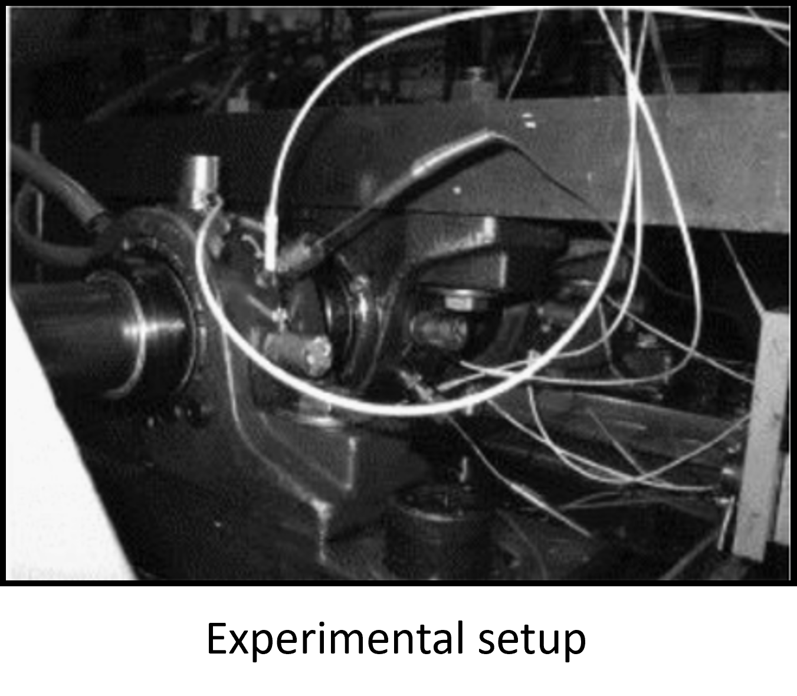
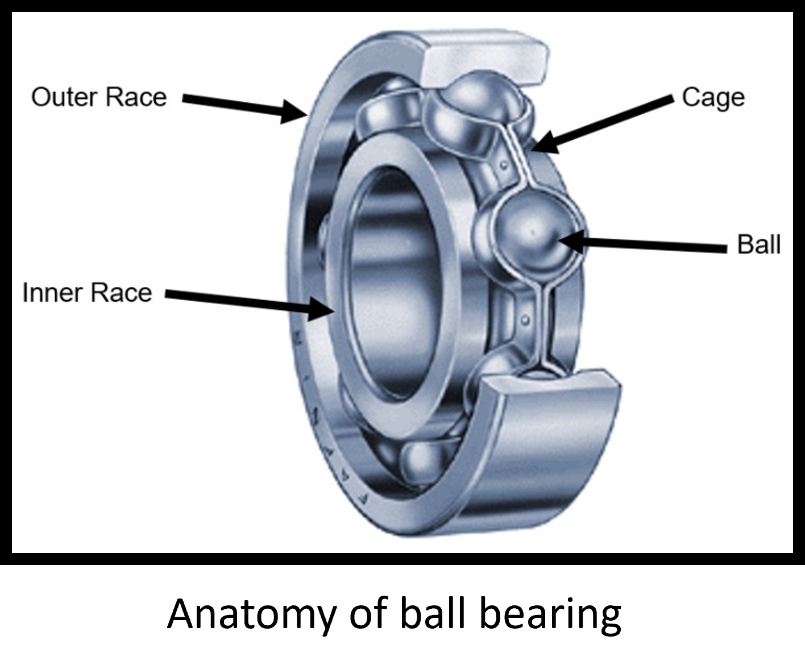
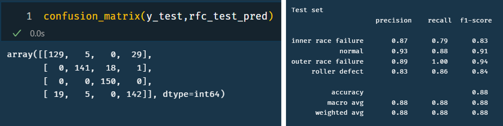

<h3> Overview </h3>

This IMX_bearing dataset is an extensive data set comprising of unstructured data from run-to-failure experiments of a ball bearing. This data has readings from 4 different sensors. The failure modes are recorded and attributed to each experiment. My objective is to use this sensor readings and predict the failure modes.

Here, the failure prediction can be accomplished in two ways. (1) A binary classification method, which can predict weather or not failure has occured or not & (2) A multiclass classification predicting the failure mode. Considering the obvious advantage of the second method, I have built ML model for multiclass failure mode prediction.

Before the actual datascience workflow, to better understand the problem statement and the physical significance of the data, let us first have a look at how the data is captured.

<h3> Experimental setup </h3>

Four bearings were installed on a shaft. The rotation speed was kept constant at 2000 RPM by an AC
motor coupled to the shaft via rub belts. A radial load of 6000 lbs is applied onto the shaft and bearing
by a spring mechanism. All bearings are force lubricated. 

Rexnord ZA-2115 double row bearings were installed on the shaft as shown in experimental setup. PCB 353B33
High Sensitivity Quartz ICP accelerometers were installed on the bearing housing (two accelerometers
for each bearing [x- and y-axes] for data set 1, one accelerometer for each bearing for data sets 2 and 3).
Sensor placement is also shown in schematic. All failures occurred after exceeding designed life time of
the bearing which is more than 100 million revolutions.

  
  
  

<h2> Data science workflow </h2>

Here, we have translated the unstructured time domain sensor data into a structured data by extracting the statistical information. We then label the time stamped stastical data with corresponding failure modes, and then balance the data to create a single dataset for further processing.

<h4>EDA</h4>

<h4>Data preprocessing</h4>

<h4>Fault identification and labelling</h4>

with proper fault identifications, we then create ML model. Here we have chosen random forest classifier to predict the failure. The obtained model has an accuracy of 88%. Its detailed confusion matrix is given below:

  

Source: <a href="https://github.com/hprutvisagar/IMX_bearing_dataset.git">hprutvisagar/IMX_bearing_dataset</a>